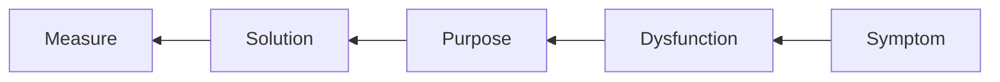

I've been working in Agile development for a few years, but have never really
"got it". The models, frameworks, methodologies always felt unapplicable, or
worse, an exercise in kabuki theare that required extra admin. This is the first
Agile conference that I've attended, and it massively helped to reframe my
understanding of Agile, and how we can use it.

## Rewilding Agile

_speaker_: [Dave Snowden](https://thecynefin.co/)

First day, first talk. Dave's talk centred on the industrialisation of Agile.
The competing standards, "certificate factories", and consultancy firms have
ultimately undermined the core principles of Agile. Instead of simplifying,
focussing on value, and delivering iteratively, Agile has become a sea of
dogmatic jargon that is often more about the process than the product. This
hugely resonated with me for a couple of reasons. First, the sea of jargon is
something I've tried unsuccessfully tried to navigate. Second, Dave's framing in
a wider systemic context was music to my ears. The real world is nowhere near as
pure as vendor's marketing materials would have us believe. The tools themselves
are not bad, but painstakingly applying them to a complex system is an exercise
in futility. Dave's talk was a call to arms; we need to rewild Agile,
cross-pollinating methods, finding the best contextual use of tools for our
circumstances. Instead of using pre-defined Agile recipes we should be chefs,
creating our own recipes from the ingredients that work for us. To provide a
framework for this, Dave introduced
[Hexi](https://cynefin.io/wiki/Method_hexi_kits). I was enthused that Hexi was
described as open-source - this seems like an obvious way of unshackling it from
consultancy dogma, although when I tried to find it, I couldn't. Irrespective,
I'm looking forward to learning more about it, and seeing how it can be applied
to my work.

## Painful outcomes: 7 mistakes I made in the shift to value-led development

_speaker_: [Holly Donohue](https://www.linkedin.com/in/hollydonohue/)

I _loved_ Holly's talk. Whilst Dave's talk was a call to arms, through using an
abstract, scientific model, Holly grounded her talk in her own experiences. The
combination of humour, humility and experience made for a compelling talk. There
was one slide in particular that immediately made the room relax; _Expectation
Vs Reality_. Holly's talk was one of the many where I was left with a sense of
"of course, why would you do anything different?". The reality is that even with
self-evident truths, we often fall into the trap of doing the wrong thing.
Saying "the quiet bit out loud", and reflecting on our mistakes is a cornerstone
of Agile, and Holly's talk was a great example of this. Holly presented seven
mistakes she made in the shift to value-led development.

### 1: Balance Discovery with Relationships

The product mindset centres on value. This is fine in perfect, emotionless
environments, but we don't live in a perfect world. Purely focussing on value
means we can alienate customers, or weaponise the Product Mindset. Holly
recounted being asked for a vanity feature; one she knew would gobble up time
and yield no value to customers. The feature, however was requested by a senior
stakeholder. Refusing the request in the name of value value would harm an
essential relationship. Conversely, developing the feature would result in lost
value; the features that added tangible value could not be delivered. Holly
offered the following advice; you need to balance value with relationships.
However logical your argument, you need to consider the emotional impact of your
delivery. building the wrong thing (vanity feature) for the right reasons (to
build social capital) is sometimes necessary to keep things moving. This
introduces a second tension; once you've set the precedent that value can be
undermined how can you ensure that the value-led approach is maintained? Holly
suggested that instead of weaponising value, and approach of alternative finding
can help find accommodations. Played out, this could be a vanity feature that
delivers tangible value to the end-user.

### 2: Stakeholder bank balance

Building on this, Holly described the importance of stakeholder relationships.
Building capital with stakeholders is essential to unblocking progress. Holly
suggests that the fastest way to do this is to pay in before you withdraw. By
building this capital, you can help ensure that when you need a favour
returning, it is there. A clever way to manage this is to have those
conversations around collaboration, "how can I help you to help us?". By
bringing the person into the process, we can avoid Project Managers working
against the team because they are implicitly excluded. On reflection, this is
such an obvious point, but it's a trap I've fallen into. Holly noted there was a
cost to this, these relationships need actively maintaining, and this can cut
into our ability to deliver, however managed correctly, it greases the wheels
and removes more fundamental blockers.

### 3: Don’t let product be a blocker

Development is difficult, knowing what to do, and how to do it is hard. A
natural reaction is to build a structure to help guide us. Holly recounted a
situation where the what and how were so complex that management were left
wondering what was happening - where was the value? Presenting to management
that your product team have done lots of valuable research, but have no features
yet is a particularly hard-sell. Holly's advice was to flip communications; to
focus on the results and impact over the process and discovery.

### 4: Change is Agile too

The only constant is change. I think it's a common experience that "this isn't
working, let's rip it up and start again". Battling against this is hard to do.
Games are rarely won by changing the rules half-way through; there isn't the
time for teams to master the new rules. Holly's advice was to make small,
iterative course-corrections; identify what can be improved, and make small
changes to enable this. Alongside this, using metrics to measure these changes
is essential. This allows us to see what is working, and what isn't. This
approach increases transparency, and helps biulding both agency within the team,
and trust with stakeholders.

### 5: Dogma = Bad

There is always more than one way to skin a cat. Becoming locked into dogma
means we are no longer open to new ways of thinking. I think that this links
back to the previous point; if we constantly change the rules, or assume we work
in a vacuum, we are not open to new ways of thinking. Agile is not agile because
you doggedly follow the process, it is agile because you are able to apply them
contextually. Holly's advice was to be open to new ways of thinking, to craft,
rather than apply solutions. Whilst this is another obvious point, there is a
clear temptation to assume "it's not working because we're not following the
rules correctly".

### 6: Shift Happens

Start thinking about what maturity looks like before you are forced to grow up.
Holly recounted a story of battling for more agency. When she was "called out"
on this, she rapidly had to figure out what agency looked like, how it can be
measured and so on. Don't get caught out, think about your own (your team's)
perfect future before it is gifted.

### 7: Don’t burn out

As a product owner, there's a risk of becoming the bottleneck for everything
product; being the punching-bag for management, the product team, and finding
accommodations. A natural response is to do more. Whilst this may work in the
short term, it will result in burn-out. The role is the role, but you have a
personal responsibility to avoid burning out. Holly's advice was to be aware of
this trap , and actively looking after yourself. Try to find sources of energy,
exercise, hobbies, socialising, and so on. This is a marathon, not a sprint.

### How we improved our ability to herd cats and deliver at scale

_Speakers_: [Samuel Cann](https://www.linkedin.com/in/sam-cann-558018a5/) & [Liam Dewes](https://www.linkedin.com/in/liamdewes/)

Cross-team collaboration is hard; It's certainly a challenge that I recognise.
Samuel and Liam Described a major project to massively engineer the back-end of
their highly complex, interleaved systems. This work impacted, and required the
cooperation of, many teams. They described starting from a traditional
hierarchical structure, and moving to a flatter, more agile one. The key to this
transformation was developing a narrative through which the teams could
understand the impact and importance of the work, and purposefully align their
efforts. To do this, they used the metaphor of the Gordian knot to frame their
solution. I think this is a good framing, but they perhaps missed a trick; the
Gordian knot was either cut or untied. Their metaphor was to cut the knot,
removing the cultural complexity. Their description however suggested they had
to untie the knot by identifying a using the leverage point of _purpose_. Rather
than defining ways of working, they gave teams agency to define their own. This
resulted in an emergent, rather than imposed, solution. They noted that as work
progressed, they were conscious of being a decision making bottleneck, and so
they worked to devolve decision making to the teams. Overall, this was an
inspiring talk; wrangling hundreds of developers across multiple countries to
achieve a single goal is no mean feat.

## You can’t talk to me like that: How to hold unbiased, non-leading customer interviews

_Speaker_: [Aras Bilgen](https://www.linkedin.com/in/arasbilgen/)

I loved this workshop. Research is something that I feel that I can do much
better. I'm glad to say I've never gone down the route of rattling through a
numbered list of questions on a clipboard, but I am guilty of leading questions.
I often go into interviews with a pre-concieved idea of what the respondent will
say, and I fall into the trap of leading them to that answer. My research is
almost uniformly done alone, I'll build a mental model of the issues and work
back from that. The unknown unknowns are often the details that are change a
solution from functionally correct to delightfully useful. Aras' workshop was a
great reminder of this. We started with a simple exercise; a simple question
which we had to figure out how to research. Working collaboratively in small
teams, we developed research themes, supporting questions, and finally adding in
prompts and reminders to keep us on track. The value of the team was clear; my
hypotheses were gently challenged, and ideas that I simply could not have come
to alone enriched the research plan. I'm looking forward to putting this into
practice both in my work and in my studies.

## Psychological safety: The link between speaking up, complexity and high-performing teams

_Speaker_: [Jitesh Gosai](https://www.jitgo.uk/blog/)

You know when someone nails a talk? This was one of those times. Jitesh used
Prezi to map out the importance of Psychological safety in a team. It's years
since I've used Prezi, and I'd forgotten how effective it can be. Jitesh
described a familiar situation; teams not realising their potential, and a
swirling undercurrent of unspoken issues. They described the importance of
understanding what psychological safety _actually means_. Instead of
superficially understanding it as "not being afraid to speak up", they described
ingraining it into the culture of the team. they described the importance of
having the confidence to speak up, and fostering an environment where it is
valued. An interesting point was around the tension between being a "nice" team,
or a "blunt" team. I think the devil is in the detail here; One team-member's
comfort level is another's discomfort. The key is to understand, and adapt to,
the needs of the team. This was one of a number of talks that reinforced the
idea of "emergent" solutions; we should be the gardeners of our teams, not the
architects.

## Nudge theory and influencing empowered teams to do the things that matter

_Speaker_: [Sarah Wells](https://www.sarahwells.dev/)

Wow. Sarah described a transformational journey at the Financial Times. Moving
platforms, moving from a monolithic architecture to a microservices, and scaling
from ~12 releases per year to ~20,000. Whilst I was picking my jaw up off the
ground from this, she moved onto the meat of the talk; how nudge theory was used
to support this change. Grounded in research, Sarah described how unifying
knowledge, making that knowledge accessible, and making the right thing the
easier to do than the wrong thing, were key to the success of the
transformation. From simple things such as making essential steps mandatory,
through to writing for new hires, the FT used nudges to guide their teams to
enable the transformation. This was a fantastic talk, and I'm looking forward
reading Sarah's book.

## Crafting workshops for connection: collective mosaic making

_Speaker_: [Jaimella Espley](https://www.linkedin.com/in/jaimella-espley-0a88bb93)

This was a powerful workshop. I went in to the workshop with little idea of what
to expect, and I was blown away by the power of the exercise. I spend my
professional life talking to people, and appreciate the power of a good
conversation. Jamella's workshop showed us the power of tactile, physical
objects. I've never been to a Lego Serious Play workshop, but the proxy of
building things strikes me as a proxy for engineering solutions rather than
appreciating the human element. The mosaic exercise was different; we were asked
to choose a piece of beach, and describe how it relates to us. composed a mosaic
which described a situation, and related to the wider group the meaning our
creations. As we iterated, and engaged with the mosaics, we found that objects
became layered with meaning; the framing of colleagues' creations gave us a way
of clarifying our own thoughts, and becoming vulnerable in a way that felt safe.
I saw the physicality of the exercise as offerin

## What's the future? - Charles Weir

Not Agile, but thought provoking. Charles described his
[research](https://ieeexplore.ieee.org/document/10380243) to identify trends
that will define the future of computing. These ranged from the ubiquity of AI
and IoT, through to the importance of privacy and security. We then workshopped
these themes to identify which we thought were linked, why, and how they may
impact us personally. I have a particularly dim view of the future; I believe
technology is advancing more quickly than we can adapt to it. To my mind there's
an epochal shift coming that will dwarf the industrial revolution. Instead of
concentrating power in the hands of thousands of industry barons working within
established social structures, I can see the power being concentrated in the
hands of a few conglomerates, who have no desire to do anything other than
generate revenue. My view was not shared by the table. The consensus was that
the future of computing offers both risk and opportunity. The risk is that we
are not able to catch the wave of this change, and are left behind. The
opportunity is that we are able to shape the future, and ensure that it is a
positive one.

## Dysfunction Mapping: A tool for empirical agile change - Michael Lloyd

see
[Dysfunction Mapping](https://medium.com/@michael_78275/dysfunction-mapping-a-tool-for-effective-agile-coaching-dc4634171b5f)

You reach the end of a scrum, and something is _wrong_. Maybe the scrum missed
its goals, testing wasn't complete, or the team is dissatisfied. The temptation
is to fix the problem, but the problem is often a symptom of a deeper issue.
Michael's talk was a great reminder of the importance of understanding the root
cause of a problem. He introduced the concept of Dysfunction Mapping; a tool to
identify and address the root causes of problems in a scrum. The tool is simple;
you start with a symptom, and work back through the dysfunction, purpose,
solution, and measure. The key to this is to identify the root cause of the
problem, rather than the symptom. This is a common trap; we see a problem, and
we fix it. The problem is that the problem is often a symptom of a deeper issue.
Michael's talk was a great reminder of the importance of understanding the root
cause of a problem.

Dysfunction mapping is something I want to try in my work. I find myself
surrounded by symptoms, but defining how to address them is often difficult.
Dysfunction mapping looks like a great way to improve systemic issues rather
than treating the symptoms.

## Guiding stakeholders along in your agile product development journey - Karim Qurie

There's a tension between governance and delivering features that _users_ want.
I've seen both sides of this; products that are so user driven that they
Frankenstein together a solution that is a nightmare to maintain, and products
that have so much red tape that they end up in a swamp of slow, painful delivery
that alienates the users. In both cases, the product becomes increasingly unfit
for purpose. Karim's talk was a great reminder of the importance of balancing
this tension. He described a situation where the product team were delivering
the features asked for the loudest voice, or those that knew the shortcuts to
asking the right person. This resulted in a product that was increasingly
reactively developed. Karim took a leaf out of the ITIL book, and introduced a a
feature request process. Users had a single, open channel to request features.
Other mechanisms were shut down to force users to use this channel. There were
two key reasons that this was successful.

### 1. Transparency

Requests were visible to all users. This meant that users could see what was
being requested, if their idea had already been requested, and where it was in
the backlog.

### 2. Alignment with Metrics

Requests had to be aligned with the North Star metric. This meant that some
requests, whilst reasonable were rejected because they did not align with
business goals.

### 3. Communication

Combining the above two points, Karim was able to reinforce the goals of the
organisation. This meant that the product teams were able to deliver features
that satisfied the users, and the business.

Karim noted that the process broadly worked for both product and platform teams,
though needed adapting for the Platforms he managed. The ownership of the
platform meant that extra care was needed to ensure that the platform was
delivering the right features.
